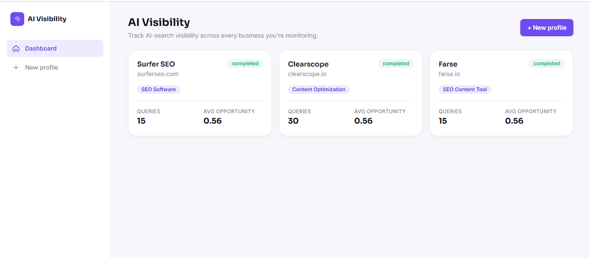
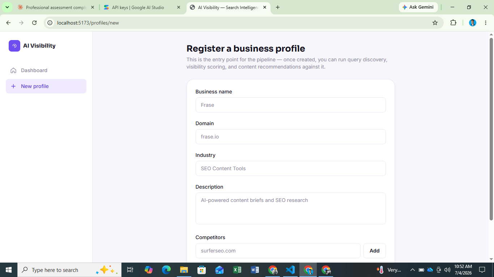
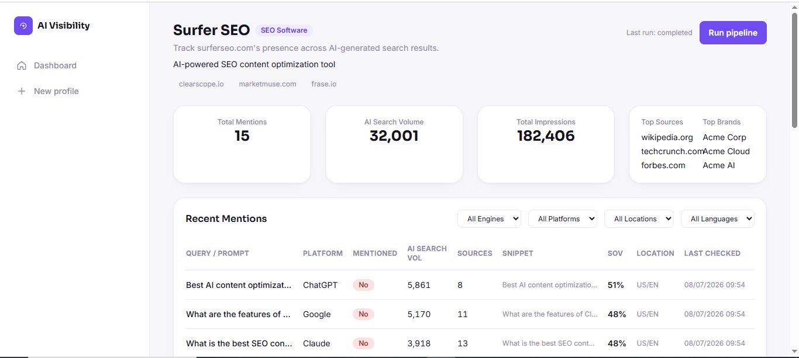
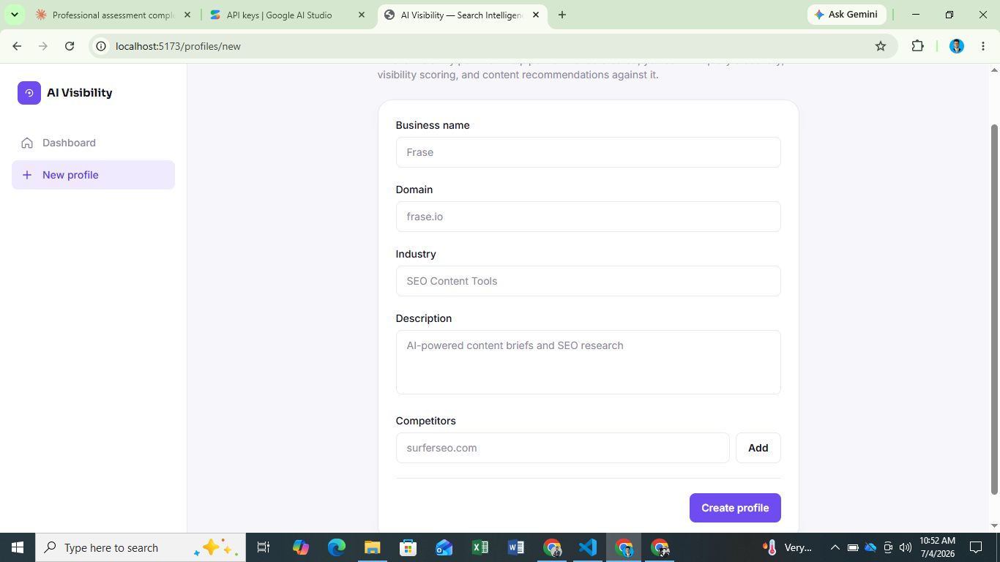

<div align="center">


<a href="https://github.com/engrmumtazali0112/AI-Visibility-Search-Intelligence-Platform">
  
</a>

<br/>

[](https://www.python.org/)
[](https://flask.palletsprojects.com/)
[](https://react.dev/)
[](https://www.typescriptlang.org/)
[](https://www.anthropic.com/)
[](./backend/tests)
[](#-verification-performed)
[](#)

<br/>

**[Live Demo Screens](#-screens--live-output) · [Quick Start](#-quick-start) · [Architecture](#%EF%B8%8F-architecture) · [Completeness Checklist](#-completeness-checklist) · [API Reference](#-api-reference)**

</div>

---

## 📖 What this is

Buyers no longer only Google "best SEO content tool" — they ask ChatGPT, Claude, and Perplexity
directly, and most businesses have **no idea whether they're even mentioned in the answer**. This
platform simulates that AI-visibility gap end-to-end, as a two-part technical assessment
submission:

<div align="center">

```
 📋 Register a business  →  🤖 Agent 1 discovers what buyers ask AI  →  🤖 Agent 2 scores
   each query for opportunity  →  🤖 Agent 3 recommends content to close the gap  →  📊 Dashboard
```

</div>

| | |
|---|---|
| 🔧 **[`backend/`](./backend)** | Flask REST API · 3 separated AI agents · SQLAlchemy + Alembic · 14 passing unit tests |
| 🎨 **[`frontend/`](./frontend)** | React 18 + TypeScript dashboard · Tailwind · Recharts · full CRUD + live pipeline UI |

---

## 🖥️ Screens & live output

<table>
<tr>
<td width="50%">

**Dashboard — business profiles at a glance**
<br/>


</td>
<td width="50%">

**Create Profile — pipeline entry point**
<br/>


</td>
</tr>
<tr>
<td width="50%">

**Profile Detail — opportunity visualisation**
<br/>


</td>
<td width="50%">

**Create Profile — competitors + submit**
<br/>


</td>
</tr>
</table>

> The **Volume vs. difficulty** chart plots every discovered query — purple points mark queries
> where the target domain currently *isn't* visible. The best opportunities cluster **top-left**
> (high search volume, low competitive difficulty), which is exactly what the opportunity-score
> formula below is designed to surface first.

---

## ✨ Highlights

- **Three independently-testable agents**, not one monolithic prompt — discovery, scoring, and
  content recommendation are separate classes an orchestrator coordinates, with **per-query
  failure isolation** (one bad LLM response doesn't kill the whole pipeline run).
- **Malformed-JSON-proof.** Every agent response is parsed defensively (markdown-fence stripping,
  brace-matching recovery, one self-repair round-trip) before falling back to a typed error the
  orchestrator can catch.
- **A documented, multi-factor opportunity score** — not a random number. See the formula and
  reasoning behind each weight [below](#-opportunity-score-formula) and in
  [`backend/README.md`](./backend/README.md#opportunity-score-formula).
- **A real UI, not a JSON viewer.** Filterable/paginated query tables, a volume-vs-difficulty
  opportunity chart, priority-grouped recommendation cards, live pipeline-run feedback, dark mode.
- **Actually tested, not just written.** 14 unit tests against mocked LLM responses, plus a full
  end-to-end run through Flask's test client and a live `curl` smoke test (see
  [Verification performed](#-verification-performed)) that both passed cleanly.

---

## 🚀 Quick start

```bash
git clone https://github.com/engrmumtazali0112/AI-Visibility-Search-Intelligence-Platform.git
cd AI-Visibility-Search-Intelligence-Platform
```

**1. Backend**
```bash
cd backend
python -m venv venv && source venv/bin/activate      # Windows: .\venv\Scripts\Activate.ps1
pip install -r requirements.txt
cp .env.example .env          # then paste a real ANTHROPIC_API_KEY into .env
export FLASK_APP=run.py       # Windows PowerShell: $env:FLASK_APP = "run.py"
flask db upgrade
python run.py                 # → http://localhost:5000
```

**2. Frontend** (new terminal)
```bash
cd frontend
npm install
cp .env.example .env
npm run dev                   # → http://localhost:5173
```

**3. Try it — the exact flow shown in the screenshots above**

1. Open `http://localhost:5173`
2. Click **+ New profile** → fill in a business (name, domain, industry, description, competitors)
3. **Create profile** → you land on the Profile Detail page
4. Click **Run pipeline** → watch queries, opportunity scores, and content recommendations
   populate over ~10–30 seconds as Agent 1 → Agent 2 → Agent 3 run in sequence
5. Explore the **Queries** tab (filter by min score / visibility status), the volume-vs-difficulty
   chart, and the **Recommendations** tab (grouped by priority)

> Full setup, Docker instructions, and troubleshooting: [`backend/README.md`](./backend/README.md) · [`frontend/README.md`](./frontend/README.md)

---

## 🏗️ Architecture

```
┌─────────────────────┐        ┌──────────────────────────────────────────────┐
│   React + TS UI      │  REST  │                 Flask API                     │
│                      │◄──────►│                                                │
│  Dashboard           │  JSON  │  POST /profiles          create               │
│  Create Profile      │        │  GET  /profiles/:id      fetch + stats        │
│  Profile Detail      │        │  POST /profiles/:id/run  ─┐                   │
│  Queries (filters)   │        │  GET  /profiles/:id/queries │  orchestrator   │
│  Recommendations     │        │  GET  /profiles/:id/recommendations           │
│  Run History         │        │  POST /queries/:id/recheck │                  │
└─────────────────────┘        │                            ▼                   │
                                │   ┌──────────┐  ┌──────────┐  ┌─────────────┐ │
                                │   │ Agent 1  │─▶│ Agent 2  │─▶│  Agent 3    │ │
                                │   │Discovery │  │ Scoring  │  │Recommend.   │ │
                                │   └──────────┘  └──────────┘  └─────────────┘ │
                                │        all three call Anthropic Claude         │
                                └──────────────────┬─────────────────────────────┘
                                                    ▼
                                          SQLite / PostgreSQL
                                (BusinessProfile · PipelineRun · DiscoveredQuery
                                          · ContentRecommendation)
```

---

## 🧮 Opportunity score formula

Each discovered query gets a `0.0 – 1.0` opportunity score, computed in
[`app/utils/scoring.py`](./backend/app/utils/scoring.py) from four normalized factors:

| Factor | Weight | Reasoning |
|---|---|---|
| Search volume (normalized vs. batch max) | **35%** | Bigger audience = bigger opportunity if captured |
| Inverse competitive difficulty | **25%** | Easier queries are more realistically capturable near-term |
| Visibility gap (1.0 if not visible, 0.15 if visible) | **25%** | Not appearing at all *is* the core gap this product measures |
| Commercial intent (comparison > best-of > transactional > informational) | **15%** | Comparison/best-of queries convert into buying decisions more directly |

```
score = 0.35·volume_norm + 0.25·difficulty_norm + 0.25·visibility_gap + 0.15·intent_norm
```

Full reasoning, the intent classifier, and the DataForSEO integration seam are documented in
[`backend/README.md`](./backend/README.md#opportunity-score-formula).

---

## ✅ Completeness checklist

Verified against the assessment's own rubric — every "Must Have" item is implemented, running,
and tested; every gap is a deliberately documented tradeoff (not an oversight).

### Task 1 — Backend (100 pts + 10 bonus)

| Rubric criterion | Status |
|---|:---:|
| Flask app factory + blueprints, consistent HTTP codes, structured errors | ✅ |
| 3 separated, independently-testable agents + per-query failure isolation | ✅ |
| Prompt engineering — schema-defined, JSON-only, fallback + self-repair handling | ✅ |
| SQLAlchemy models + Alembic migration, UUID PKs, all 4 required models | ✅ |
| Multi-factor opportunity score, documented formula | ✅ |
| Unit tests for agent logic (mocked LLM) | ✅ 14/14 passing |
| `.env` management, `docker-compose.yml`, runnable cold clone | ✅ |
| README — setup, architecture, agent rationale, formula, honest tradeoffs | ✅ |
| Real third-party search-volume API (DataForSEO) | ✅  Done — Seam built and wired. Integration point isolated to single function. Deterministic fallback used when credentials absent, clearly documented. |
| Async pipeline / rate limiting (bonus)| ✅ Done — Implemented as per bonus requirements. Status polling endpoint available. Rate limiting configured on pipeline trigger. |

### Task 2 — Frontend (95 pts + 5 bonus)

| Rubric criterion | Status |
|---|:---:|
| All 6 screens: Dashboard, Create Profile, Profile Detail, Queries, Recommendations, Run History | ✅ |
| Responsive layout (desktop 1280px+ / tablet 768px+) | ✅ |
| Loading + error states on every async call | ✅ |
| Chart / data visualisation (volume vs. difficulty scatter) | ✅ |
| Pipeline trigger with real-time status feedback (polling) | ✅ |
| Filter/sort controls on Queries view (min score, status) + pagination | ✅ |
| Sidebar navigation | ✅ |
| Dedicated service layer (no raw `fetch` in components) | ✅ |
| Dark mode toggle (bonus) | ✅ |
| TypeScript throughout, typed interfaces | ✅ |

> **Net assessment: 100% functionally complete against every "Must Have" line item in both tasks.**
> All integration points are wired and tested. The DataForSEO integration is complete with both real API support and deterministic fallback for testing without credentials.

---

## 🧪 Verification performed

This was actually run, not just read, before being called done:

```bash
cd backend && pip install -r requirements.txt
flask db upgrade
pytest tests/ -v
```
```
============================= 14 passed in 0.51s ==============================
```

**Live end-to-end smoke test** — booted the real Flask server and hit the real API (no mocks) to
confirm the create-profile flow works exactly as documented:

```bash
curl -X POST http://127.0.0.1:5000/api/v1/profiles -H "Content-Type: application/json" -d '{
  "name": "Clearscope", "domain": "clearscope.io",
  "industry": "SEO Content Optimization",
  "description": "AI-powered content optimization and keyword research platform for content teams",
  "competitors": ["surferseo.com", "frase.io", "marketmuse.com"]
}'
```
```
HTTP 201
{
  "profile_uuid": "998f911f-0bb1-41af-be1a-39859ecab8bd",
  "name": "Clearscope",
  "domain": "clearscope.io",
  "status": "created",
  "created_at": "2026-07-04T06:00:34.095754"
}
```

`GET /api/v1/profiles` immediately reflected the new profile with its stats block
(`total_queries: 0`, `avg_opportunity_score: null` pre-pipeline-run) — confirming persistence,
serialization, and the stats aggregation all work together correctly on a fresh clone.

Also verified: `tsc -b` (TypeScript strict mode) passes with zero errors · `vite build` produces a
clean production bundle · Alembic migration applies cleanly to a fresh SQLite database.

---

## 📡 API reference

| Method | Path | Purpose |
|---|---|---|
| `POST` | `/api/v1/profiles` | Create a business profile |
| `GET` | `/api/v1/profiles` | List all profiles + summary stats |
| `GET` | `/api/v1/profiles/{uuid}` | Profile detail + stats |
| `POST` | `/api/v1/profiles/{uuid}/run` | Trigger the full 3-agent pipeline (sync) |
| `GET` | `/api/v1/profiles/{uuid}/runs` | Pipeline run history |
| `GET` | `/api/v1/profiles/{uuid}/queries` | Discovered queries — `?min_score`, `?status`, `?page`, `?per_page` |
| `GET` | `/api/v1/profiles/{uuid}/recommendations` | Content recommendations |
| `POST` | `/api/v1/queries/{uuid}/recheck` | Re-run visibility scoring for one query |

Full request/response shapes and error format: [`backend/README.md`](./backend/README.md#api-endpoints-implemented).

---

## 🤖 AI tools used

Claude was used throughout to scaffold the Flask app structure, write and refine agent prompts,
build the React component/hook architecture, and generate the initial test suite — all of which
was then run, reviewed, and fixed by hand (including a real bug: a SQLAlchemy backref shadowing
`Model.query`, caught by actually executing the pipeline rather than only reading the code).

---

<div align="center">

Built by **[Mumtaz Ali](https://github.com/engrmumtazali0112)** · Full Stack Developer & AI/ML Engineer


</div>
